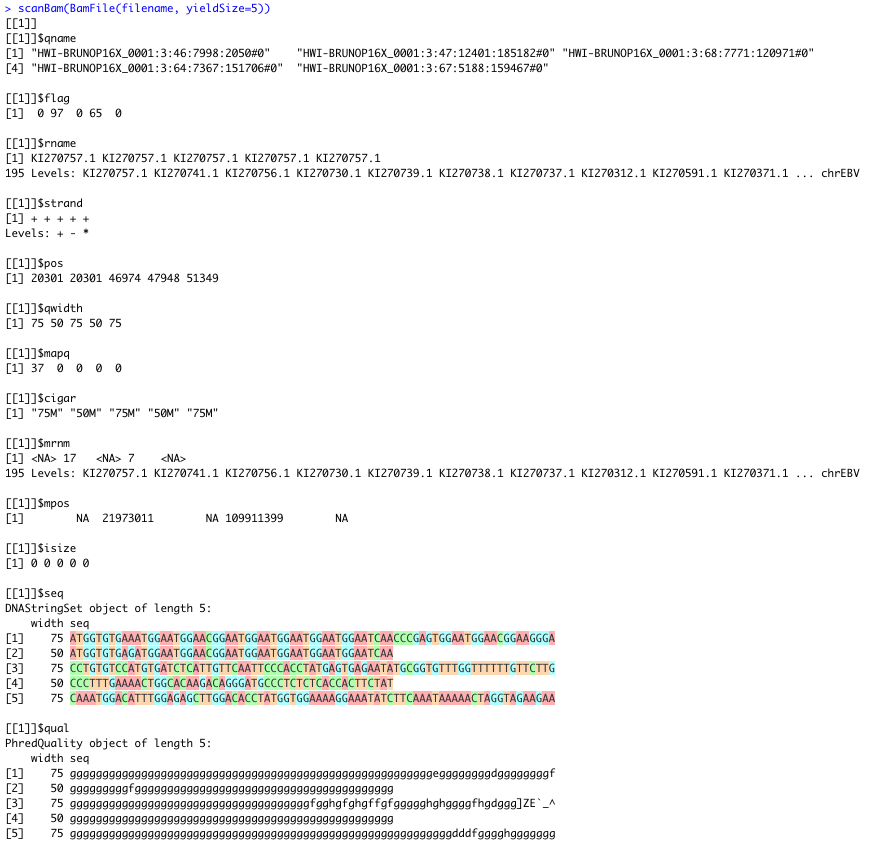

```
Date created:  May 8, 2021
Last edited:   March 15, 2022
```

```{r setup, include=FALSE}
knitr::opts_chunk$set(echo = TRUE)
```

# Data

The data for this example come from an `Ensembl` genome browser web page (release 105; Dec 2021):

 * Ensembl Single species data, Human (homo sapiens), `GRCh38.illumina.brain.1.bam`:
    * Link to the information about the datasets: https://www.ensembl.org/info/data/ftp/index.html;
    * [Direct link to the FTP browser](http://ftp.ensembl.org/pub/release-105/bamcov/homo_sapiens/genebuild/).
 
 From the `README` of the data repository:
 
  > _Female brain tissue with poly-A selection (50bp PE + 75bp SE)_
 
 About the `Ensembl`:
 
  > _Ensembl is a genome browser for vertebrate genomes that supports research in comparative genomics, evolution, sequence variation and transcriptional regulation. Ensembl annotate genes, computes multiple alignments, predicts regulatory function and collects disease data. Ensembl tools include BLAST, BLAT, BioMart and the Variant Effect Predictor (VEP) for all supported species._
 
### During downloading a file

First step of the current tutorial is downloading the file named: 

 * `GRCh38.illumina.brain.1.bam` [Note: the file have approx. `8.3GB`]

(Please note that the download speed from Ensembl's FTP server is quite low, as I got download speed of 200-300 KB for a file as large as 8.3 GB, so the downloading took several hours.)

Then move the downloaded file in the same directory as your R Markdown (or the R console's working directory).

### Gemonic file formats

A primer on what are the differences between particular genomics data file formats is available at Institute for Systems Genomics -- University of Conneticut's web page: [Bioinformatics => UCONN => Resources and Events => Tutorials => File Formats Tutorial ](https://bioinformatics.uconn.edu/resources-and-events/tutorials-2/file-formats-tutorial/).

See also the differences between FASTA, FASTQ, SAM, and BAM [explained here](https://bioinformatics.stackexchange.com/a/385) (with additional references).

In short:

 * FASTA -- nucleotide or amino acid *sequences* of nucleic acids and proteins (thereafter: "sequences")
 * FASTQ -- sequences + quality
 * SAM -- sequences + quality + mapping (to a reference)
 * BAM -- binary form of SAM
 
Hence, BAM files cannot be simply viewed in a file system (e.g., by using bash's `cat` command or a notepad) -- instead it has to be loaded with a software package, such as the Bioconductor.

# Loading BAM files

Information on what libraries are needed to load and manipulate on BAM files can be found, .e.g., in the course by Irizarry & Love (2015): [Importing NGS data into Bioconductor](https://genomicsclass.github.io/book/pages/import_NGS.html).

The first step of loading the data in our example is to import the required library: `Rsamtools`. (During importing the `Rsamtools` library there are pleanty of messages being displayed. In order to make the output here in the R Markdown clear, these messages were hidden. See [how to hide output in R Markdown](https://bookdown.org/yihui/rmarkdown-cookbook/hide-one.html#hide-one)):

```{r libraries, results='hide', message=FALSE, warning=FALSE}
library(Rsamtools)
```

Define a filename -- the name of the file that was downloaded:

```{r path}
filename = 'GRCh38.illumina.brain.1.bam'
```

Get information of the *size* of the file. BAM is a binary file, below `R` command will display the size in `"autp"` scale, e.g., "Kb"/"Gb", etc.:
```{r file_size}
utils:::format.object_size(file.info(filename)$size, "auto")
```

Because the file is has over 7 GB `Rsamtools` does not loads the entire file right away. Instead the object representing genetic data is created and the data (information on sequences, quality and/or mapping) is loaded on request, see below.

Load the BAM file (create an object representing the file):

```{r load}
bf <- BamFile(filename)
bf
```

# Accessing sequence information

## `seqinfo` function

The basic object storing sequence information is [`SeqInfo`](https://www.rdocumentation.org/packages/GenomeInfoDb/versions/1.8.3/topics/seqinfo) (notice the difference between `seqinfo` -- that is a function [lowercase], and `SeqInfo` [camel case] -- that is an object). The `SeqInfo` object can be created (obtained) with the following `seqinfo` function:

```{r sequence_info}
seqinfo(bf)
```

For further data handling, it is pretty convenient to convert a `SeqInfo` object into `R`'s native `data.frame` object, e.g., in order to preview all rows of the `SeqInfo` data and visualize the information contained in this data structure. For an information on how to convert `SeqInfo` into `data.frame`, see: [this GenomeInfoDb MIT resource]( https://web.mit.edu/~r/current/arch/i386_linux26/lib/R/library/GenomeInfoDb/html/Seqinfo-class.html).

In order to perform the conversion use the following command:

```{r complete_print}
df <- as.data.frame(seqinfo(bf))
head(df)
```

For more information on `seqinfo` and `seqlengths`, see: [this R documentation page](https://www.rdocumentation.org/packages/GenomeInfoDb/versions/1.8.3/topics/seqinfo).

---

### Sequence information as a `data.frame`

`df` is a data frame -- a named list. We can use `rownames` to see the names of the particular rows (i.e., names of the indexes, see: https://swcarpentry.github.io/r-novice-inflammation/13-supp-data-structures/):

```{r show_row_names}
rownames(df)
```

We are interested only in a subset of sequences:

```{r selected_sequences}
sequences_on_interest = c("1",   "2",  "3",  "4",  "5",  "6",  "7",  "8",  "9", "10",
                          "11", "12", "13", "14", "15", "16", "17", "18", "19", "20",
                          "21", "22",
                          "X", "Y", "MT", "chrEBV")
```

Now, we want to get `df`'s rows by row names (how to get rows by row names: https://stackoverflow.com/a/18933280/8877692):

```{r get_by_row_names}
df_selection <- df[sequences_on_interest, , drop = FALSE]
df_selection
```

Get also information on all the other sequences:

```{r get_other}
df_other <- df[!(row.names(df) %in% sequences_on_interest), , drop = FALSE]
head(df_other)
```

## Plotting sequence lenghts

For plotting, we need only the `seqlenghts` column. In this example all the other columns are `NA`s, so only the `seqlenghts` will be plotted.


We will use a basic [R bar plotting](http://www.sthda.com/english/wiki/ggplot2-barplots-quick-start-guide-r-software-and-data-visualization) `ggplot` utility.

```{r import_ggplot}
library(ggplot2)
```

Plot sequence lengths for particular chromosomes:

```{r barplot_selected, fig.width = 10}
# Chromosomes on X axis and sequence lengths on Y axis
ggplot(df_selection, aes(rownames(df_selection), seqlengths)) +
  
  # Y values are given
  geom_bar(stat='identity') +
  
  # Commas at thousand places
  scale_y_continuous(labels = function(x) format(x, big.mark = ",",
                                                 scientific = FALSE)) +
  
  # Rotate axes for better readability
  theme(axis.text.x = element_text(angle = 45, hjust=1)) +

  # Don't sort labels on X axis alphabetically
  scale_x_discrete(limits=rownames(df_selection)) +
  
  # Plot and axis titles are useful
  ggtitle('Sequence lenghts per chromosome') +
  theme(plot.title = element_text(hjust = 0.5)) +
  xlab('Chromosome') + 
  ylab('Sequence lenght')
```

Plot the length of the other sequences:

```{r barplot_other, fig.width = 24, , fig.height = 12}
# Chromosomes on X axis and sequence lengths on Y axis
ggplot(df_other, aes(rownames(df_other), seqlengths)) +
  
  # Y values are given
  geom_bar(stat='identity') +
  
  # Commas at thousand places
  scale_y_continuous(labels = function(x) format(x, big.mark = ",",
                                                 scientific = FALSE)) +
  
  # Rotate axes for better readability
  theme(axis.text.x = element_text(angle = 45, hjust=1)) +

  # Don't sort labels on X axis alphabetically
  scale_x_discrete(limits=rownames(df_other)) +
  
  # Plot and axis titles are useful
  ggtitle('Sequence lenghts per chromosome') +
  theme(plot.title = element_text(hjust = 0.5)) +
  # Font size of the X axis labels
  theme(axis.text.x = element_text(size = 6)) +
  xlab('Sequence name') + 
  ylab('Sequence lenght')
```

Use `Ctrl` + `+` (or `Cmd` + `+`, or `Ctrl`/`Cmd` + `scrolls`) to zoom in on the sequence names on the X axis.

---

Technical comments on the above plotting utility:

 * `SeqInfo` object is a data frame with row names. For how-to plot these with `ggplot` see: [this discussion thread](https://groups.google.com/g/ggplot2/c/UkmDYDcRNWc/m/YOI02Vp5qvMJ).
 
 * Commas are used as thousand separators for better presentation of the scale. See [this answer](https://stackoverflow.com/a/47465028/8877692) for an explanation how this was achieved.

 * `stat='identity'` is used, instead of `stat='count'`, because the Y values are there already.

 * By default `ggplot` sorts bars alphabetically (x axis labels). In order to prevent this, see [this solution](https://stackoverflow.com/a/46779995/8877692).
 
***

# Additional materials and notes

Following [the course by Irizarry & Love, (2015)](https://genomicsclass.github.io/book/pages/import_NGS.html) more operations and/or inspection options are available for BAM files with the `Rsamtools` library.

## BAM file summary

The code below (`quickBamFlagSummary(bf)`) is not performed as part of this R Markdown, because it takes too much time to process this command. Moreover, you need a lot of RAM and swap memory to perform this command on large files (e.g., larger than 8GB).

(See how to not evaluate an R cell in R Markdown [here](https://www.rstudio.com/wp-content/uploads/2015/02/rmarkdown-cheatsheet.pdf).) 

```{r bam_summary, eval=FALSE}
quickBamFlagSummary(bf)
```

The output of the above command should be similar to:

```
                                group |    nb of |    nb of | mean / max
                                   of |  records |   unique | records per
                              records | in group |   QNAMEs | unique QNAME
All records........................ A | 17010970 | 17010970 |    1 / 1
  o template has single segment.... S | 17010970 | 17010970 |    1 / 1
  o template has multiple segments. M |        0 |        0 |   NA / NA
      - first segment.............. F |        0 |        0 |   NA / NA
      - last segment............... L |        0 |        0 |   NA / NA
      - other segment.............. O |        0 |        0 |   NA / NA

Note that (S, M) is a partitioning of A, and (F, L, O) is a partitioning of M.
Indentation reflects this.

Details for group S:
  o record is mapped.............. S1 | 14921660 | 14921660 |    1 / 1
      - primary alignment......... S2 | 14921660 | 14921660 |    1 / 1
      - secondary alignment....... S3 |        0 |        0 |   NA / NA
  o record is unmapped............ S4 |  2089310 |  2089310 |    1 / 1
```

## Scanning a BAM file

```{r scan_bam}
scanBam(BamFile(filename, yieldSize=5))
```

---

R Studio's console **colors** the output:



## Further reading

 * [`GenomicAlignment` Bioconductor package](https://bioconductor.org/packages/release/bioc/vignettes/GenomicAlignments/inst/doc/GenomicAlignmentsIntroduction.pdf)

 * [Circular plots with `ggbio`](https://www.bioconductor.org/packages/release/bioc/vignettes/ggbio/inst/doc/ggbio.pdf)
 
 * [R markdown figure size (the global size)](https://sebastiansauer.github.io/figure_sizing_knitr/) (`knitr::opts_chunk$set(fig.width=12, fig.height=8)`)

***

# Literature

 * Irizarry, R., & Love, M. (2015). Ph525x series-biomedical data science. URL: https://genomicsclass.github.io/book/pages/import_NGS.html