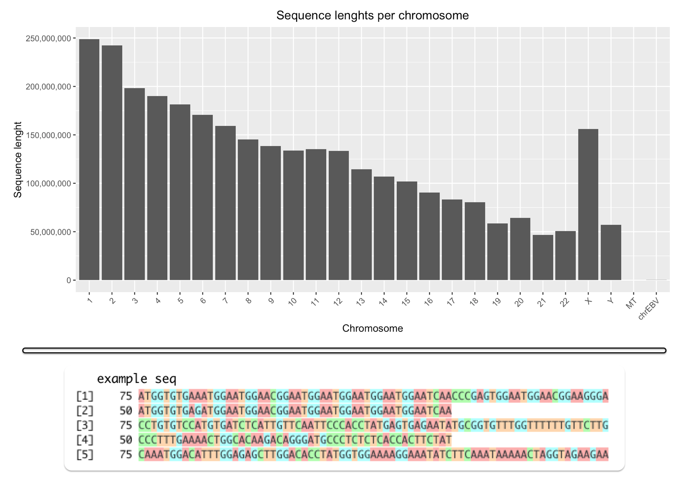

# Loading BAM files with R

An example on how to load BAM file and preview sequence information (in `R Markdown`).

## Data

The data for this example come from an `Ensembl` genome browser web page (release 105; Dec 2021):

 * Ensembl Single species data, Human (homo sapiens), `GRCh38.illumina.brain.1.bam`:
    * Link to the information about the datasets: https://www.ensembl.org/info/data/ftp/index.html;
    * [Direct link to the FTP browser](http://ftp.ensembl.org/pub/release-105/bamcov/homo_sapiens/genebuild/).
    * **Caution**: Dataset size is approx. `8.9 GB`
 
 Why this dataset was selected?

  * It is free and open
  * It regards homo sapiens
  * Information on chromosomes is available