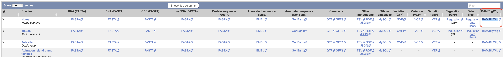

# Ensembl

```
The content in this document is an adaptation of the README document that can be found along the data that are described below.
```




Link to the general information: [https://www.ensembl.org/info/data/ftp/index.html](https://www.ensembl.org/info/data/ftp/index.html)

Direct link to FTP resources: [http://ftp.ensembl.org/pub/release-105/bamcov/homo_sapiens/genebuild/](http://ftp.ensembl.org/pub/release-105/bamcov/homo_sapiens/genebuild/)


Note
----
Based on a recommendation of the Genome Reference Consortium, the reads were aligned against the genome using the Epstein-Barr virus as a decoy. The name of the sequence in the BAM files is chrEBV.

All files have an index files `(.bai)` and a bigwig file (.bw) which contains the coverage information.

Use the md5sum.txt file to check the integrity of the downloaded files.


List of files
-------------
```
GRCh38.illumina.adipose.1.bam        Female adipose tissue with poly-A selection (50bp PE + 75bp SE)
GRCh38.illumina.adrenal.1.bam        Male adrenal tissue with poly-A selection (50bp PE + 75bp SE)
GRCh38.illumina.blood.1.bam          Male white blood cells with poly-A selection (50bp PE + 75bp SE)

+======================================================================================================+
|GRCh38.illumina.brain.1.bam          Female brain tissue with poly-A selection (50bp PE + 75bp SE)    | <- this was selected
+======================================================================================================+

GRCh38.illumina.breast.1.bam         Female breast tissue with poly-A selection (50bp PE + 75bp SE)
GRCh38.illumina.colon.1.bam          Female colon tissue with poly-A selection (50bp PE + 75bp SE)
GRCh38.illumina.heart.1.bam          Female heart tissue with poly-A selection (50bp PE + 75bp SE)
GRCh38.illumina.kidney.1.bam         Female kidney tissue with poly-A selection (50bp PE + 75bp SE)
GRCh38.illumina.liver.1.bam          Male liver tissue with poly-A selection (50bp PE + 75bp SE)
GRCh38.illumina.lung.1.bam           Male lung tissue with poly-A selection (50bp PE + 75bp SE)
GRCh38.illumina.lymph.1.bam          Female lymph tissue with poly-A selection (50bp PE + 75bp SE)
GRCh38.illumina.merged.1.bam         Set of all individual samples merged with the poly-A selected pooled set without normalisation (50bp PE + 75bp SE + 100bp SE)
GRCh38.illumina.ovary.1.bam          Female ovary tissue with poly-A selection (50bp PE + 75bp SE)
GRCh38.illumina.pled_polyA.1.bam     Pooled set from all the samples with poly-A selection (100bp SE)
GRCh38.illumina.pled_polyA_Nor.1.bam Pooled set from all the samples with poly-A selection and normalisation (100bp SE)
GRCh38.illumina.pled_RiboFree.1.bam  Pooled set from all the samples without poly-A selection to enrich for non-coding RNA (100bp SE)
GRCh38.illumina.prostate.1.bam       Male prostate tissue with poly-A selection (50bp PE + 75bp SE)
GRCh38.illumina.sk_muscle.1.bam      Male skeletal muscle tissue with poly-A selection (50bp PE + 75bp SE)
GRCh38.illumina.testes.1.bam         Male testes tissue with poly-A selection (50bp PE + 75bp SE)
GRCh38.illumina.thyroid.1.bam        Female thyroid tissue with poly-A selection (50bp PE + 75bp SE)
```